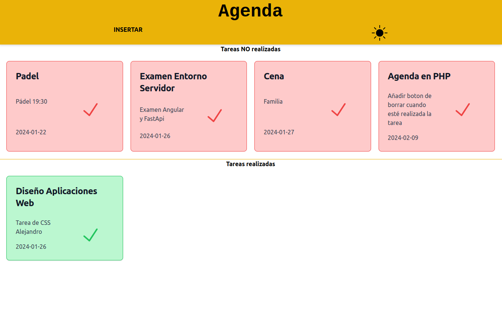

# Agenda WEB (No terminado)

Agenda creada que surge de la necesidad de gestionar mis tareas diarias.

1. __FRONTEND:__ Creado con TailWindCSS
2. __BACKEND:__ Creado con PHP nativo.

Base de datos relacional. Incluyo el archivo para crear la __base de datos__ en el archivo [tabla.sql](./bd/tabla.sql).

Para que funcione cambiar en el archivo [conexion.php](./pages/conexion.php) las credenciales.

