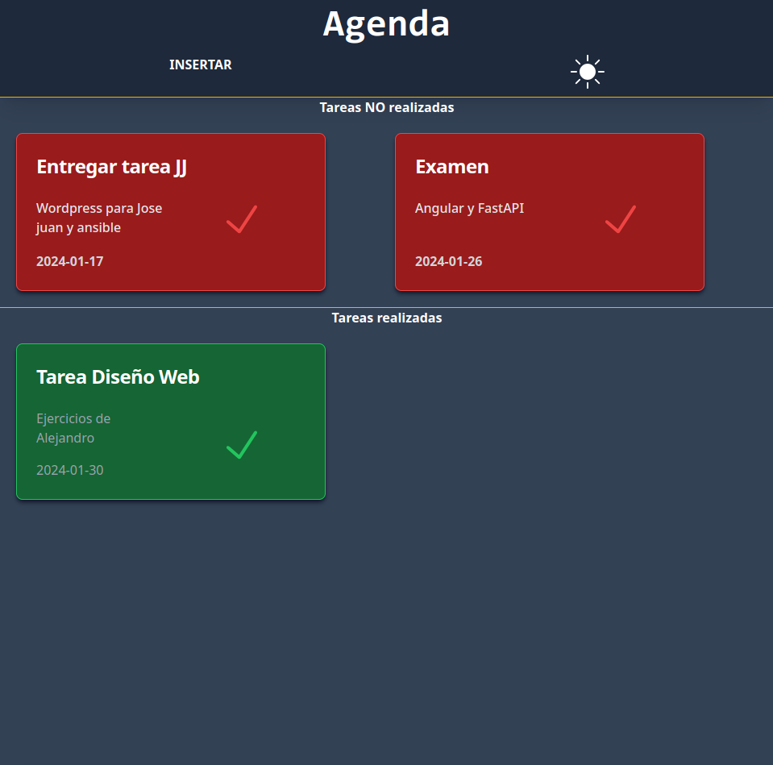
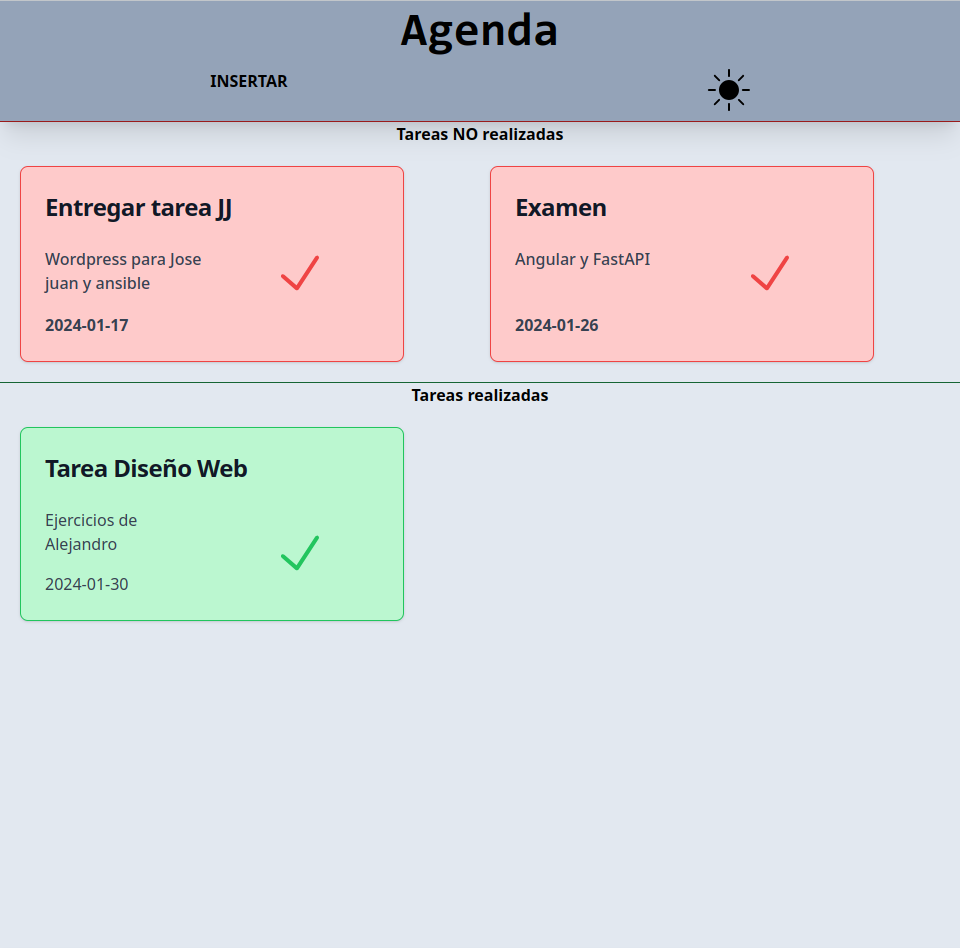
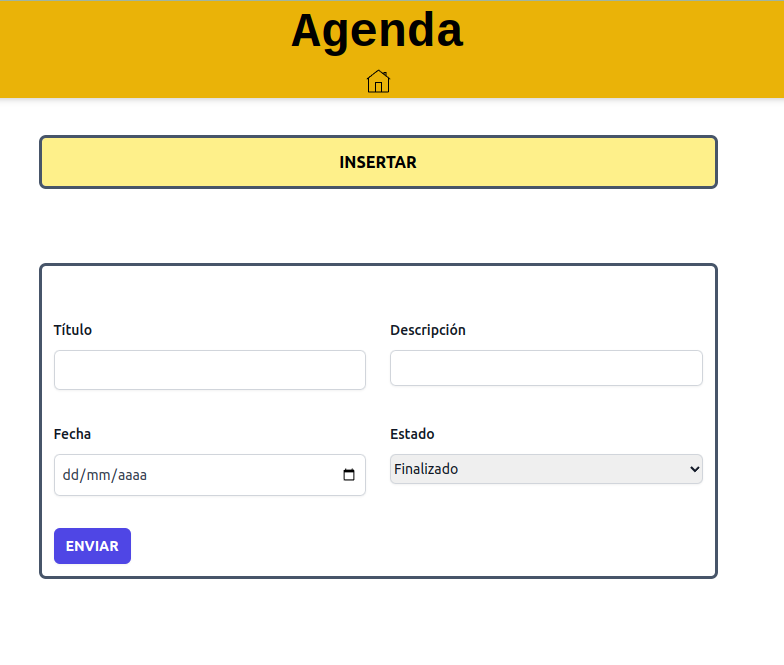

# Agenda WEB (No terminado)

Agenda creada que surge de la necesidad de gestionar mis tareas diarias.

1. __FRONTEND:__ Creado con TailWindCSS
2. __BACKEND:__ Creado con PHP nativo.
3. __BASE DE DATOS__ relacional. (Incluyo el archivo para crear la base de datos en el archivo [tabla.sql](./bd/tabla.sql)).

### Funcionalidades

- Añadir tareas, marcar como realizadas o no realizadas.
- Ordenación de las tareas por fecha.
- Modo claro/oscuro con un botón gracias a la facilidad que nos ofrece TailwindCSS.
- Aplicación sencilla que facilita la navegación a traves de ella.

Para que funcione cambiar en el archivo [conexion.php](./pages/conexion.php) las credenciales.

__PÁGINA PRINCIPAL COLOR OSCURO__

__PÁGINA PRINCIPAL COLOR CLARO__

__FORMULARIO__
